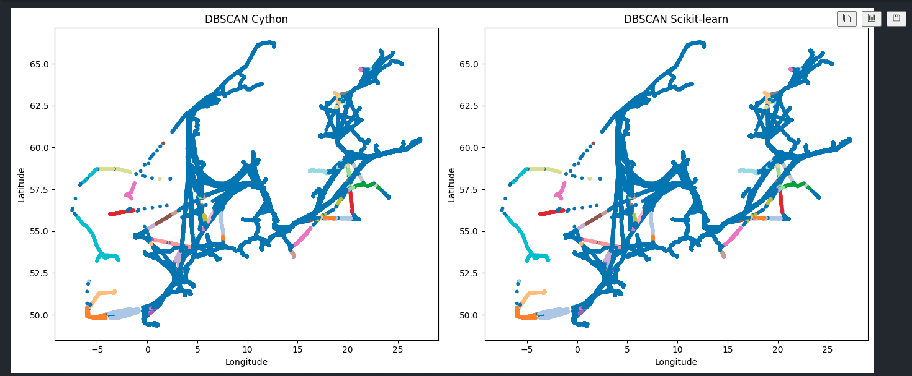

# Comparativa de DBSCAN: Scikit-learn vs DBSCAN en Cython

## Objetivo

Este proyecto tiene como objetivo comparar el rendimiento y precisión del algoritmo de clustering **DBSCAN** implementado en:

- `scikit-learn` (versión en Python puro)
-  `Cython` (versión compilada y optimizada)

Se analizan diferencias significativas en:

- Tiempo de ejecución
- Precisión del clustering
-  Escalabilidad ante grandes volúmenes de datos geoespaciales

---

## Contexto de Aplicación

Este trabajo se enmarca dentro de un sistema de análisis marítimo, orientado a:

- Detectar patrones de navegación con datos AIS
- Optimizar el reconocimiento de trayectorias marítimas

---

##  ¿Qué se compara?

| Criterio               | Scikit-learn DBSCAN | Cython DBSCAN |
|------------------------|---------------------|----------------|
| Tiempo de ejecución    | Más lento            |  Más rápido |
| Precisión              | Alta                 | Alta (idéntica con mismos parámetros) |
| Facilidad de uso       | Más intuitivo     | Requiere compilación |
| Escalabilidad          | Limitada             |  Mejorada (ideal para calculos maritimos) |

Ambas versiones se ejecutaron sobre los **mismos datos georreferenciados** (`res_8`) y usando los mismos hiperparámetros `eps` y `min_samples`.

---

##  Dataset de Prueba

Se utilizó una muestra balanceada de datos marítimos con las siguientes características:

- Estado de navegación (`nav_status`)
- Muestra equilibrada con totalidad de registros
- Hexágonos H3 (`res_8`) precalculados para integración futura

---

##  Próximos pasos

- [ ] Optimizar el código Cython con `prange` y OpenMP
- [ ] Comparar con versiones distribuidas (`Dask`, `Spark`)
- [ ] Visualización en mapas interactivos con `Folium` + `GeoPandas`

---

## Conclusión

La implementación en **Cython** logra mantener la precisión de DBSCAN mientras reduce significativamente el **tiempo de ejecución**.

> Esta mejora la hace especialmente útil para entornos de **procesamiento masivo de datos geoespaciales**.

---

